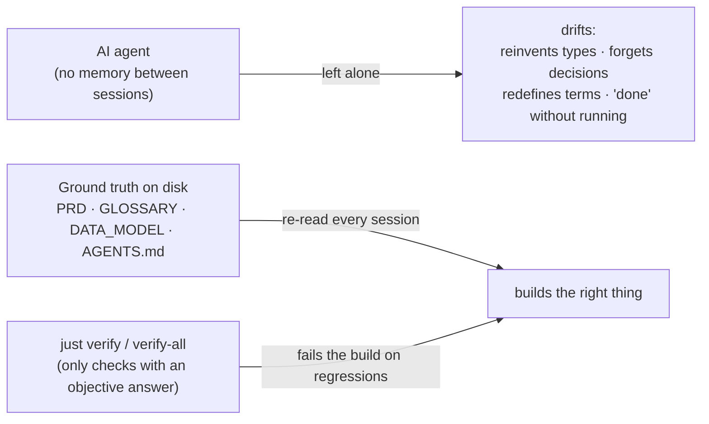
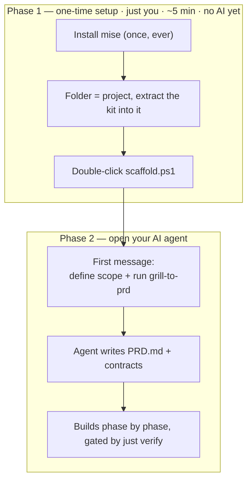

# Suds vibe coding kit
A small set of files you drop into a project before you write code, so AI coding agents stop drifting — without spending their budget proving they followed a process.

<p align="center">
  
</p>

<p align="center">
  
  
  
  
  
</p>

<p align="center"><b>A small set of files you drop into a project <i>before</i> you write code, so AI coding agents stop drifting — without spending their budget proving they followed a process.</b></p>

---

## The problem it solves

An AI coding agent has **no memory between sessions**, so left alone it *drifts*: it reinvents your types, forgets yesterday's decisions, quietly redefines your domain words, and announces "done" without ever running the code. You can't prompt this away — the forgetting is structural.

So the kit does the one thing that works: it **writes the ground truth to plain files on disk** that the agent re-reads every session, and — *wherever a check has an objective answer* — lets a single command fail the build. You never "run" the kit; **your agent reads it.**



> **The design rule that keeps it lean:** *gate the product, not the process.* Check things with an objective truth (does it compile? does the API exist? does the app boot?). Never gate the agent's own bookkeeping — that was the v6 failure mode, where the agent spent ~80% of its reasoning proving it had followed the kit. v6.1 removed it; everything since stays prose-and-suggestions over enforcement.

---

## How to use it — two phases

The only thing beginners trip on is the seam between these two phases.



### Phase 1 — one-time setup (Windows)

Don't overthink these; they only put the files in place and nothing here can harm your machine.

```bash
# 1. Install the one prerequisite — once, ever, on your computer:
winget install jdx.mise          # (it quietly installs just/uv/node/pnpm + ast-grep for you)

# 2. Make a folder, name it your project, and extract the kit INTO it (no sub-folder).
#    This folder IS your app.

# 3. Double-click scaffold.ps1   (WSL: bash scaffold.sh)
#    → sets up the toolchain, git, and the safety gates, makes the first commit,
#      and prints your first prompt. Safe to run twice.
```

### Phase 2 — open your AI agent (the first message matters)

Open your coding agent in the folder. **Don't start with "build me a …".** Your first message defines the **scope** and runs the *grill* — it interviews you one question at a time and turns your answers into a spec (`PRD.md`), so the agent builds the *right* thing instead of guessing. **This is the step people skip.**

```text
Read CONTEXT.md and the files it lists. Then run the grill-to-prd skill
(skills/grill-to-prd.md): interview me ONE question at a time, recommending an
answer for each, until the scope is fully clear. Do NOT write code or scaffold
yet. Then write PRD.md and we'll build phase by phase.
```

> Skip the grill and the agent invents the requirements — the #1 way it builds the wrong thing. Five minutes of questions here saves hours of rework.

---

## macOS / Linux — one prompt to adapt the kit

The kit is authored Windows-first (it ships `scaffold.sh` for WSL/Unix already). To adapt the rest for macOS or Linux, paste this into your agent **after extracting the kit**:

```text
I'm on macOS/Linux. Adapt this kit for my platform WITHOUT changing its rules or
philosophy:
1. Use scaffold.sh (not the .ps1). Install the one prerequisite with
   `curl https://mise.run | sh`  (macOS alternative: `brew install mise`).
2. When the final phase generates server-control scripts, generate POSIX
   start-server.sh / stop-server.sh (kill-by-port via lsof or fuser) instead of the
   PowerShell .ps1 templates — still reading PORT from .env, never hardcoded.
3. Keep just, uv, pnpm, ast-grep, the justfile, and ALL gates exactly as they are —
   they're already cross-platform via mise.
4. Leave AGENTS.md and every contract file unchanged.
Show me a summary of what you changed.
```

Everything else (`just`, `uv`, `pnpm`, `ast-grep`, the gates) is already cross-platform through `mise`.

---

## Everyday scenarios (copy, paste, go)

| When you're… | Paste this |
|---|---|
| **Continuing where you left off** | `Read RepoMapReadFirst.md and STATE.md, tell me where we are in two sentences, then continue.` |
| **Adding a feature** | `I want to add <feature>. Update PRD.md / EXECUTION_PLAN.md for it first (separate commit), then build it phase by phase per AGENTS.md.` |
| **Planning a big/complex change** | `This is a large task. Follow AGENTS.md §4b: write a dated plan in plans/, keep phases small, show me the plan, then execute phase by phase.` |
| **Switching to a different AI tool** | `Read CONTEXT.md and the files it lists, then continue from STATE.md, following AGENTS.md.` |
| **Building any UI (avoid "AI slop")** | See `PROMPTS.md` §Q — encodes `DESIGN_GUIDELINES.md` into the build prompt. |
| **After fixing a bug** | `Add it to SinsGotchasLearnings.md as a prose entry (an ast-grep rule only if it's a clean structural pattern).` |

---

## What's in the kit

| Group | Files | Job |
|---|---|---|
| **Contracts** (ground truth) | `PRD.md` · `GLOSSARY.md` · `DATA_MODEL.md` · `ARCHITECTURE.md` · `DESIGN_GUIDELINES.md` · `types/` | What the app does, every term, the data grain & units, the architecture, the visual standard. |
| **Governance** (how the agent works) | `AGENTS.md` (single source of truth) · `CONTEXT.md` · `EXECUTION_PLAN.md` · `STATE.md` · `MODEL_NOTES.md` · `PROMPTS.md` | Rules, routing, the phased plan, the live cursor, per-model tips, the reusable prompt library. |
| **Memory & gates** (enforced only where objective) | `RepoMapReadFirst.md` · `SinsGotchasLearnings.md` + `rules/*.sins.yml` · `OpenTasksMustCompleteAll.md` · `UserPromptLog.md` · `WorkLogAfterEachRun.md` · `justfile` | The repo map, the defect taxonomy (some compiled to ast-grep rules), the anti-drop checklist, passive prompt log, work log, and the `just verify` / `just verify-all` gates. |

Every other tool-config file (`CLAUDE.md`, `GEMINI.md`, `.cursor/`, `.kilocode/`, `.windsurfrules`, `.zed/`, `.rules`, `.codex/`) is a **three-line pointer** back to `AGENTS.md`, so rules can't drift.

### Supported tools

Claude Code · OpenAI Codex CLI · Gemini / Antigravity · Cursor · Windsurf · Kilocode · Zed · OpenCode · Hermes — **any tool that reads `AGENTS.md` works.** Tested with GLM, DeepSeek, MiniMax, MiMo, Claude, and Gemini.

---

## Why it works

- **It externalizes the memory the agent doesn't have** — files named so the filename itself signals the purpose (`OpenTasksMustCompleteAll`, `RepoMapReadFirst`).
- **It converts the few objectively-checkable rules into gates** — a rule in a doc is a suggestion; the same rule as a `just verify` check is a wall.
- **It makes the right thing the cheap thing** — re-orienting from `RepoMapReadFirst.md` costs ~2k tokens instead of a 50k re-walk; trusting a green gate beats re-checking by hand.
- **It refuses to gate process** — anything that would police the agent's own prose is left as a suggestion, so the agent spends its budget building, not proving.

Read `VibeCodingKit_FieldGuide_v6.4.md` for the full rationale, or open `VibeCodingKit_Infographic_v6.4.html` for the visual one-pager.

---

## Inspirations & credits

This kit stands on existing ideas and tools:

- **`grill-to-prd`** is adapted from **Matt Pocock's** `grill-with-docs` skill — a relentless one-question-at-a-time requirements interview.
- **`AGENTS.md`** follows the emerging cross-tool agent-instructions convention, so one rules file serves every agent.
- **[ast-grep](https://ast-grep.github.io/)** powers the structural defect audits (a real parser, never regex on code).
- **[mise](https://mise.jdx.dev/)** is the one-prerequisite toolchain manager; **[just](https://github.com/casey/just)** is the command runner behind the two gates.
- **[Playwright](https://playwright.dev/)** backs the `smoke` gate so "done" means run-and-observed.
- The optional hierarchical `AGENTS.md` layer (§10) is inspired by the **DOX** documentation-as-context framework.
- v6.4's *inline flags* and *reuse-first* ideas were distilled from studying a production SAFe multi-agent harness — taking the ideas, not the team-process overhead.

---

<p align="center"><sub>Plain files + two commands. No GitHub, no service, no runtime dependency required.</sub></p>
