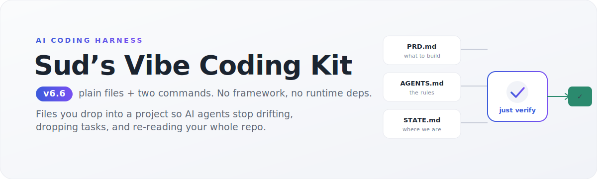
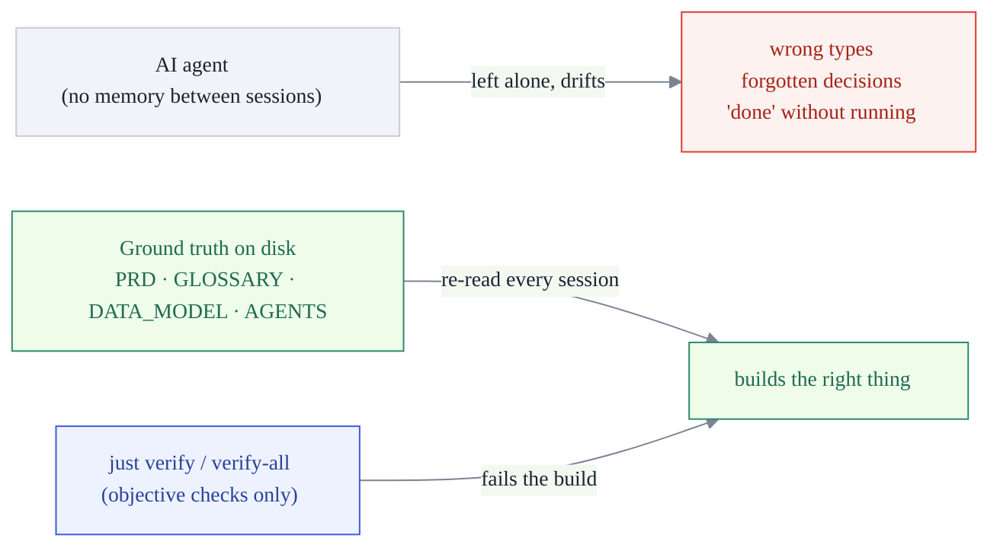
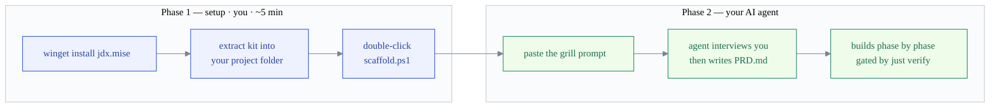

<p align="center">
  
</p>

<p align="center">
  
  
  
  
  
  
</p>

<p align="center"><b>A small set of files you drop into a project <i>before</i> you write code, so AI coding agents stop drifting — without spending their budget proving they followed a process.</b></p>

<p align="center">
  <sub><b>What's new in v6.6:</b> a ceremony router with skip conditions · test-quality rules & seams-first eval · feedback-loop debugging · vertical-slice phasing · two-axis phase reviews · deep-module design vocabulary · prototype-to-answer · handoff discipline · zero-steering kit upgrades.</sub>
</p>

<br>

## Why this exists

```
  ┌──────────────────────┐         ┌──────────────────────┐
  │   Without the kit    │         │    With the kit      │
  ├──────────────────────┤         ├──────────────────────┤
  │  agent re-invents    │         │  agent re-reads      │
  │  your types          │         │  ground-truth files  │
  │                      │         │                      │
  │  "done" = code typed │         │  "done" = runs green │
  │                      │         │                      │
  │  forgets yesterday's │         │  STATE.md is the     │
  │  decisions           │         │  baton between tools │
  │                      │         │                      │
  │  drifts silently     │         │  verify fails loud   │
  └──────────────────────┘         └──────────────────────┘
```

An AI coding agent has **no memory between sessions**, so left alone it *drifts* — it reinvents your types, forgets yesterday's decisions, quietly redefines your domain words, and announces "done" without ever running the code. **You can't prompt this away; the forgetting is structural.**

So the kit does the one thing that works: it **writes the ground truth to plain files on disk** that the agent re-reads every session, and — *wherever a check has an objective answer* — lets a single command fail the build. You never "run" the kit; **your agent reads it.**



> **The design rule that keeps it lean:** *gate the product, not the process.* Check things with an objective truth (does it compile? does the API exist? does the app boot?). Never gate the agent's own bookkeeping — that was the v6 failure mode, where the agent spent ~80% of its reasoning proving it had followed the kit. v6.1 removed it; everything since stays prose-and-suggestions over enforcement.

---

## The 5-minute setup

The only thing beginners trip on is the **seam between two phases**: first you put the files in place (no AI yet), then you open your agent with a carefully-worded first message.



### Phase 1 — one-time setup (Windows)

Don't overthink these; they only put files in place and nothing here can harm your machine.

```bash
# 1. Install the one prerequisite — once, ever, on your computer:
winget install jdx.mise          # (provisions just/uv/node/pnpm + ast-grep)

# 2. Make a folder, name it your project, and extract the kit INTO it (no sub-folder).
#    This folder IS your app.

# 3. Double-click scaffold.ps1   (WSL: bash scaffold.sh)
#    → sets up toolchain, git, the safety gates, makes the first commit,
#      and prints your first prompt. Safe to run twice.
```

### Phase 2 — open your AI agent (the first message matters)

Open your coding agent in the folder. **Don't start with "build me a …".** Your first message defines the **scope** and runs the *grill* — it interviews you one question at a time and turns your answers into a spec (`PRD.md`), so the agent builds the *right* thing instead of guessing. **This is the step people skip.**

```text
Read CONTEXT.md and the files it lists. Then run the grill-to-prd skill
(skills/grill-to-prd.md): interview me ONE question at a time, recommending an
answer for each, until the scope is fully clear. Do NOT write code or scaffold
yet. Then write PRD.md and we'll build phase by phase.
```

> Skip the grill and the agent invents the requirements — the #1 way it builds the wrong thing. Five minutes of questions here saves hours of rework.

---

## The everyday loop

Once set up, every session follows the same cheap rhythm:

```
  ┌───────────────────────────────────────────────────────────────────┐
  │                                                                   │
  │   1. RESUME   "Read RepoMapReadFirst.md and STATE.md,            │
  │                tell me where we are, then continue."   ~2k tokens │
  │                           │                                       │
  │                           ▼                                       │
  │   2. WORK     do the next task per EXECUTION_PLAN.md             │
  │                           │                                       │
  │                           ▼                                       │
  │   3. CHECK    just verify            run freely, mid-work        │
  │                           │                                       │
  │                           ▼ green                                 │
  │   4. COMMIT   just verify-all        pre-commit gate; must pass  │
  │                           │                                       │
  │                           ▼                                       │
  │   5. UPDATE   STATE.md cursor  ──▶  next task                    │
  │                                                                   │
  └───────────────────────────────────────────────────────────────────┘
```

| When you're… | Paste this |
|:---|:---|
| **Continuing where you left off** | `Read RepoMapReadFirst.md and STATE.md, tell me where we are in two sentences, then continue.` |
| **Adding a feature** | `I want to add <feature>. Update PRD.md / EXECUTION_PLAN.md for it first (separate commit), then build it phase by phase per AGENTS.md.` |
| **Planning a big change** | `This is a large task. Follow AGENTS.md §4b: write a dated plan in plans/, keep phases small, show me the plan, then execute phase by phase.` |
| **Switching AI tools / ending mid-task** | `Run skills/handoff.md: update STATE.md so the next agent resumes cold, then leave the repo verify-all-green.` |
| **Building a UI (avoid "AI slop")** | See `PROMPTS.md` §Q — encodes `DESIGN_GUIDELINES.md` into the build prompt. |
| **After fixing a bug** | `Add it to SinsGotchasLearnings.md as a prose entry (an ast-grep rule only if it's a clean structural pattern).` |
| **A bug survived a fix attempt** | `Follow skills/diagnose-bugs.md: build a red-capable ONE-command repro first (an existing failing test counts), then 3–5 ranked falsifiable hypotheses.` |
| **Closing a phase** | `Run skills/code-review.md on the phase diff: Standards and Spec as two parallel reviews, reported separately.` |
| **Upgrading the kit (v6.6 — hands-off)** | Drop the new kit in `.kit-incoming/`, then: `Read .kit-incoming/migrate/UPGRADE_AUTOPILOT.md and execute it end to end with zero questions; give me the final report.` |

---

## What's in the kit

| Group | Files | Job |
|:---|:---|:---|
| **Contracts** *(ground truth)* | `PRD.md` · `GLOSSARY.md` · `DATA_MODEL.md` · `ARCHITECTURE.md` · `DESIGN_GUIDELINES.md` · `types/` | What the app does, every term, the data grain & units, the architecture, the visual standard. |
| **Governance** *(how the agent works)* | `AGENTS.md` *(single source of truth)* · `CONTEXT.md` · `EXECUTION_PLAN.md` · `STATE.md` · `MODEL_NOTES.md` · `PROMPTS.md` | Rules, routing, the phased plan, the live cursor, per-model tips, the reusable prompt library. |
| **Memory & gates** *(enforced only where objective)* | `RepoMapReadFirst.md` · `SinsGotchasLearnings.md` + `rules/*.sins.yml` · `OpenTasksMustCompleteAll.md` · `UserPromptLog.md` · `WorkLogAfterEachRun.md` · `justfile` | The repo map, the defect taxonomy (some compiled to ast-grep rules), the anti-drop checklist, passive prompt log, work log, and the gates. |

Every other tool-config file (`CLAUDE.md`, `GEMINI.md`, `.cursor/`, `.kilocode/`, `.windsurfrules`, `.zed/`, `.codex/`) is a **three-line pointer** back to `AGENTS.md`, so rules can't drift.

### The four commands

| Command | When | What it checks |
|:---|:---|:---|
| `just verify` | freely, mid-work | lint · typecheck · tests · library APIs · schema · ast-grep audit · doc-freshness |
| `just verify-all` | before commit / CI | everything in `verify` + tasks-done · prompt-log · app smoke test |
| `just doctor` | new machine, or if a gate looks off | self-tests that every configured gate can actually execute (no silent skips) |
| `just sins-triage` | when the taxonomy grows | promotion candidates, entries missing triggers, digest budget |

### Supported tools

Claude Code · OpenAI Codex CLI · Gemini / Antigravity · Cursor · Windsurf · Kilocode · Zed · OpenCode · Stagewise · Qoder · Hermes — **any tool that reads `AGENTS.md` works.** Tested with GLM 5.2, DeepSeek V4 Pro, Xiaomi MiMo 2.5 Pro, MiniMax M3, Claude, and Gemini.

---

## Why it works

| Principle | What it does |
|:---|:---|
| **Externalizes the memory the agent doesn't have** | Files named so the filename signals the purpose (`OpenTasksMustCompleteAll`, `RepoMapReadFirst`). |
| **Converts the few objective rules into gates** | A rule in a doc is a *suggestion*; the same rule as a `just verify` check is a *wall*. |
| **Makes the right thing the cheap thing** | Re-orienting from `RepoMapReadFirst.md` costs ~2k tokens vs. a 50k re-walk. |
| **Refuses to gate process** | Anything policing the agent's own prose stays a suggestion — so the agent builds, not proves. |

Read `VibeCodingKit_FieldGuide_v6.6.md` for the full rationale, or open `VibeCodingKit_Infographic_v6.6.html` for the visual one-pager.

---

## What's new in v6.6

v6.6 shapes **the work itself**: it distills the durable engineering discipline from **Matt Pocock's `skills` library (v1.1.0)** into kit shape — one through-line for every unit of engineering, a dispatcher that says when each discipline fires *and when to skip it*, and a hands-off kit upgrade. All prose; no new gates; no new per-turn ceremony.

| # | Improvement | What it closes |
|:---:|:---|:---|
| 1 | **The ceremony router** (`AGENTS.md` §0a) — situation → discipline → cost → **SKIP when**; skip conditions as binding as triggers; `sins-triage` audits the machinery's own weight | Quality ceremonies firing where their cost exceeds their value (the v6.0 disease) |
| 2 | **Test quality has rules** (§2, §4a) — no implementation-coupled or tautological tests, mock only true externals, no all-tests-up-front; eval-first starts by agreeing the seams (**the interface is the test surface**), red before green | Tests that pass but prove nothing, and die on every refactor |
| 3 | **Feedback-loop debugging** (`skills/diagnose-bugs.md`) — ONE failed fix → build a red-capable one-command repro before attempt 2 (an existing failing test counts); minimise; 3–5 ranked falsifiable hypotheses; regression test at a correct seam | Thrashing on a hard bug with guess-after-guess |
| 4 | **Vertical-slice phasing + context hygiene** (§4b) — every phase a demoable **tracer bullet**; wide refactors go expand → migrate → contract; hand off at phase boundaries via `skills/handoff.md`, never compact mid-phase | Horizontal layers nothing can demo, and lossy mid-work compaction |
| 5 | **Two-axis phase review** (`skills/code-review.md`) — Standards (repo rules + smell baseline) and Spec (acceptance criteria, scope creep) as parallel subagents, **never merged** | One review axis masking the other; silent scope creep |
| 6 | **Deep modules & prototypes** (`skills/deep-modules.md`, `skills/prototype-to-answer.md`) — the deletion test, design-it-twice at 3+ callers, throwaway prototypes that answer undecidable design questions then get deleted (with a real graduation path) | Shallow pass-through modules; design debates that never resolve |
| 7 | **Zero-steering upgrades** (`migrate/UPGRADE_AUTOPILOT.md` + `migrate_kit.py --auto`) — drop the new kit in `.kit-incoming/`, say "upgrade the kit": discovery, backup, branch, WIP snapshot, hash-classified apply, deterministic sins merge, rule-based semantic merges, verify, commit, report | Hand-diffing ~30 files every kit release |

> **Upgrading from any older kit?** That's item 7 — two actions: drop the kit in, read the report.

<details>
<summary><b>v6.5 — trustworthy gates, docs that can't rot, a learning loop with a motor</b></summary>

v6.5 attacked the three failure modes observed across real builds — **gates that silently no-op'd, descriptive files that decayed into fiction, and a sins file that documented mistakes without preventing repeats** — and stays true to v6.1's *"gate the product, not the process."* No new per-turn ceremony.

| # | Improvement | What it closes |
|:---:|:---|:---|
| 1 | **No silent false-greens** — a configured-but-missing tool now fails loudly (exit 3 + the fix command); the JS package manager is detected from the lockfile; **`just doctor`** self-tests the harness | A real harness once silently no-op'd for an entire phase because "skipping" warnings were scrolled past |
| 2 | **Docs that can't rot** (